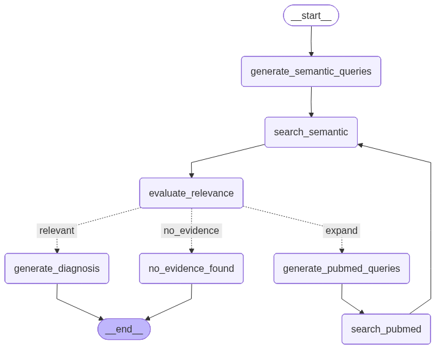

# 🏥 Physio AI - Sistema de Diagnóstico Fisioterapéutico Inteligente

[](https://www.python.org/downloads/)
[](https://fastapi.tiangolo.com/)
[](https://langchain-ai.github.io/langgraph/)
[](https://openai.com/)

## 📋 Descripción del Proyecto

**Physio AI** es un sistema de diagnóstico fisioterapéutico inteligente que utiliza tecnologías de vanguardia en Inteligencia Artificial para proporcionar evaluaciones específicas de fisioterapia basadas en evidencia científica. El sistema está diseñado exclusivamente para fisioterapeutas, ofreciendo diagnósticos diferenciales musculoesqueléticos, recomendaciones de tratamiento fisioterapéutico y acceso a la literatura científica especializada en rehabilitación y fisioterapia.

> **⚠️ Descargo de responsabilidad:**  
> Este proyecto es únicamente para fines de aprendizaje e investigación. **Physio AI no debe utilizarse bajo ninguna circunstancia como consejo médico, diagnóstico clínico ni sustituto de la consulta con un profesional sanitario cualificado.**  
> Si tienes síntomas, dudas sobre tu salud o necesitas orientación médica, acude siempre a un fisioterapeuta o profesional de la salud titulado.

### 🎯 Características Principales

- **Diagnóstico Fisioterapéutico**: Generación automática de diagnósticos musculoesqueléticos basados en síntomas del paciente
- **Búsqueda Semántica**: Acceso a evidencia fisioterapéutica a través de búsqueda vectorial en Qdrant
- **Integración PubMed**: Búsqueda en la base de datos científica más grande del mundo para fisioterapia y rehabilitación
- **Flujo de Trabajo Inteligente**: Sistema de grafos con LangGraph para toma de decisiones fisioterapéuticas
- **API RESTful**: Interfaz moderna y documentada con FastAPI
- **Arquitectura Modular**: Diseño limpio y mantenible siguiendo principios SOLID

## 🏗️ Arquitectura del Sistema

### Componentes del Sistema

#### 1. **Capa de Presentación (Controllers)**

- **`diagnosis_controller.py`**: Maneja endpoints de la API REST
- **Singleton Pattern**: Instancias únicas de servicios para optimización
- **Dependency Injection**: Inyección de dependencias para testing y mantenibilidad

#### 2. **Capa de Servicios (Services)**

- **`diagnosis_service.py`**: Orquesta el flujo de diagnóstico principal con LangGraph
- **`semantic_search_service.py`**: Búsqueda vectorial en Qdrant
- **`pubmed_service.py`**: Integración con la API de PubMed

#### 3. **Capa de Herramientas (Tools)**

- **`search_tools.py`**: Generación de consultas optimizadas para búsquedas
- **`evaluation_tools.py`**: Evaluación de relevancia de evidencia médica
- **`diagnosis_tools.py`**: Generación de diagnósticos y evaluaciones

#### 4. **Capa de Datos (Models)**

- **`DiagnosisRequest`**: Modelo de entrada para solicitudes de diagnóstico médico
- **`DiagnosisResponse`**: Modelo de respuesta estructurada con información médica
- **Validación Pydantic**: Schemas robustos y validación automática

#### 5. **Flujo de Trabajo (LangGraph)**

- **Grafos de Estado**: Flujos condicionales e iterativos para diagnóstico médico
- **Nodos de Decisión**: Evaluación automática de relevancia de evidencia médica
- **Expansión de Búsqueda**: Búsqueda iterativa hasta encontrar evidencia suficiente



## 🚀 Tecnologías Utilizadas

### Backend y API

- **FastAPI**: Framework web moderno y rápido para Python
- **Pydantic**: Validación de datos y serialización
- **Uvicorn**: Servidor ASGI de alto rendimiento

### Inteligencia Artificial

- **OpenAI GPT-5-nano**: Modelo de lenguaje para generación de diagnósticos fisioterapéuticos
- **LangChain**: Framework para aplicaciones de IA
- **LangGraph**: Construcción de flujos de trabajo inteligentes para fisioterapia
- **Qdrant**: Base de datos vectorial para búsqueda semántica de evidencia fisioterapéutica

### Búsqueda y Datos

- **PubMed API**: Acceso a la base de datos científica más grande del mundo para fisioterapia y rehabilitación
- **Biopython**: Procesamiento de datos biomédicos y fisioterapéuticos
- **Unstructured**: Procesamiento de documentos científicos de fisioterapia

### Desarrollo y Testing

- **Docker**: Containerización de la aplicación

## 📦 Instalación y Configuración

### Prerrequisitos

- Python 3.12 o superior
- Docker (opcional, para containerización)
- Cuenta de OpenAI con API key
- Cuenta de Qdrant Cloud

### 1. Clonar el Repositorio

```bash
git clone https://github.com/osscarvalls/physio_ai
cd physio-ai
```

### 2. Crear Entorno Virtual

```bash
python -m venv env
source env/bin/activate  # En Windows: env\Scripts\activate
```

### 3. Instalar Dependencias

```bash
pip install -r requirements.txt
```

### 4. Configurar Variables de Entorno

```bash
cp env.example .env
```

Editar `.env` con tus credenciales:

```env
# OpenAI Configuration
OPENAI_API_KEY=sk-your-actual-api-key-here
OPENAI_PROJECT_ID=your-project-id

# Qdrant Cloud Configuration
QDRANT_URL=https://your-cluster-id.eu-central-1-0.aws.cloud.qdrant.io
QDRANT_API_KEY=your-qdrant-api-key

# PubMed Configuration
ENTREZ_EMAIL=tu-email@ejemplo.com

# Server Configuration
HOST=0.0.0.0
PORT=8000
DEBUG=true
```

### 5. Ejecutar la Aplicación

```bash
python run.py
```

La API estará disponible en: http://localhost:8000

## 🔧 Uso de la API

### Endpoints Disponibles

#### 1. **Generar Diagnóstico Fisioterapéutico**

```http
POST /api/v1/diagnosis
Content-Type: application/json

{
  "symptoms": "Dolor en la rodilla derecha al subir escaleras",
  "patient_age": 45,
  "patient_gender": "masculino",
  "medical_history": "Lesión deportiva hace 2 años"
}
```

#### 2. **Verificar Estado del Servicio**

```http
GET /api/v1/health
```

#### 3. **Reinicializar Servicios**

```http
POST /api/v1/reinitialize
```

### Ejemplos de Uso

#### Ejemplo 1: Diagnóstico Fisioterapéutico - Dolor de Rodilla

```bash
curl -X POST "http://localhost:8000/api/v1/diagnosis" \
  -H "Content-Type: application/json" \
  -d '{
    "symptoms": "Dolor en la rodilla derecha al subir escaleras, especialmente por la mañana. El dolor se intensifica al hacer sentadillas.",
    "patient_age": 45,
    "patient_gender": "masculino",
    "medical_history": "Paciente activo, practica running 3 veces por semana"
  }'
```

**Respuesta Esperada:**

```json
{
  "patient_situation": "Hombre de 45 años, activo, con dolor en rodilla derecha al subir escaleras",
  "diagnostic_suggestions": [
    "Síndrome patelofemoral",
    "Tendinopatía rotuliana",
    "Osteoartritis temprana de rodilla"
  ],
  "confirmation_tests": [
    "Prueba de McMurray",
    "Prueba de compresión patelar",
    "Evaluación de fuerza muscular"
  ],
  "diagnosis": "Posible síndrome patelofemoral o tendinopatía rotuliana",
  "confidence": 0.75,
  "evidence_quality": "Alta",
  "recommendations": [
    "Ejercicios de fortalecimiento de cuádriceps",
    "Técnicas de manejo del dolor",
    "Evaluación fisioterapéutica completa"
  ],
  "missing_information": [
    "Historia clínica detallada",
    "Radiografías de rodilla",
    "Evaluación de alineación patelar"
  ],
  "timestamp": "2024-01-15T10:30:00"
}
```

#### Ejemplo 2: Diagnóstico Fisioterapéutico - Dolor de Espalda

```bash
curl -X POST "http://localhost:8000/api/v1/diagnosis" \
  -H "Content-Type: application/json" \
  -d '{
    "symptoms": "Dolor lumbar que se irradia hacia la pierna derecha, empeora al estar sentado",
    "patient_age": 32,
    "patient_gender": "femenino",
    "medical_history": "Trabajo de oficina, 8 horas sentada"
  }'
```

#### Ejemplo 3: Diagnóstico Fisioterapéutico - Lesión de Hombro

```bash
curl -X POST "http://localhost:8000/api/v1/diagnosis" \
  -H "Content-Type: application/json" \
  -d '{
    "symptoms": "Dolor en hombro derecho al levantar el brazo, limitación de movimiento",
    "patient_age": 28,
    "patient_gender": "masculino",
    "medical_history": "Paciente practica natación regularmente"
  }'
```

## 🔍 Flujo de Diagnóstico Fisioterapéutico

### 1. **Generación de Consultas**

El sistema genera consultas optimizadas para:

- Búsqueda semántica en Qdrant de evidencia fisioterapéutica
- Búsqueda en PubMed de literatura científica de fisioterapia

### 2. **Búsqueda de Evidencia**

- Búsqueda vectorial en base de datos de fisioterapia
- Filtrado de duplicados por PMID

### 3. **Evaluación de Relevancia**

- Scoring de 0-10 para el conjunto de la evidencia recopilada
- Criterios de relevancia específicos
- Decisión automática de expansión de búsqueda

### 4. **Generación de Diagnóstico**

- Análisis de síntomas y evidencia
- Generación de diagnósticos diferenciales
- Recomendaciones de tratamiento basadas en evidencia científica

### 5. **Respuesta Estructurada**

- JSON con toda la información relevante
- Nivel de confianza del diagnóstico
- Información faltante identificada para evaluación completa

## 🐳 Setup en Docker

### Construir Imagen

```bash
docker build -t pysio-ai .
```

### Ejecutar Contenedor

```bash
docker run -p 8000:8000 --env-file .env pysio-ai
```

### Usando Makefile

```bash
make build    # Construir imagen
make run      # Ejecutar contenedor
make stop     # Detener contenedor
make clean    # Limpiar contenedor
```

## 🚧 TO-DO: Próximos Pasos para Producción

1. **Trazabilidad y Explicabilidad**

   - [ ] Crear un proyecto en LangSmith para trazabilidad y explicabilidad de los flujos de IA
   - [ ] Integrar la aplicación con LangSmith para registrar y visualizar los pasos de razonamiento y las decisiones tomadas por los modelos
   - [ ] Documentar cómo acceder a los registros y explicaciones generadas en LangSmith
   - [ ] Añadir ejemplos de análisis de trazabilidad y explicabilidad para casos de uso relevantes

2. **Despliegue en la Nube**

   - [ ] Seleccionar proveedor cloud (ej. AWS, GCP, Azure, Railway, Render, etc.)
   - [ ] Configurar variables de entorno seguras en el entorno cloud
   - [ ] Crear recursos necesarios (máquina virtual, contenedor, almacenamiento, etc.)
   - [ ] Automatizar el despliegue usando Docker y/o scripts de infraestructura como código (IaC)
   - [ ] Configurar HTTPS y dominios personalizados si es necesario

3. **Pipeline de Testing**

   - [ ] Implementar tests unitarios para los servicios principales (`app/services/`)
   - [ ] Añadir tests de integración para endpoints de la API
   - [ ] Usar frameworks como `pytest` y `httpx` para pruebas automáticas
   - [ ] Configurar cobertura de código (coverage) y reportes automáticos

4. **Pipeline de CI/CD**

   - [ ] Configurar un pipeline en GitHub Actions, GitLab CI, o similar
   - [ ] Incluir los siguientes pasos en el pipeline:
     - [ ] Instalación de dependencias
     - [ ] Ejecución de tests y validación de cobertura
     - [ ] Linter y formateo de código (ej. `black`, `flake8`)
     - [ ] Build de la imagen Docker
     - [ ] Despliegue automático a la nube en rama principal o tags de release
   - [ ] Notificaciones de fallos o despliegues exitosos (Slack, email, etc.)

5. **Documentación y Buenas Prácticas**

   - [ ] Mejorar la documentación de endpoints y ejemplos de uso
   - [ ] Añadir instrucciones de troubleshooting y FAQ
   - [ ] Definir políticas de versionado y releases

6. **Monitoreo y Observabilidad**
   - [ ] Configurar logs centralizados y alertas
   - [ ] Añadir métricas de uso y salud del sistema
